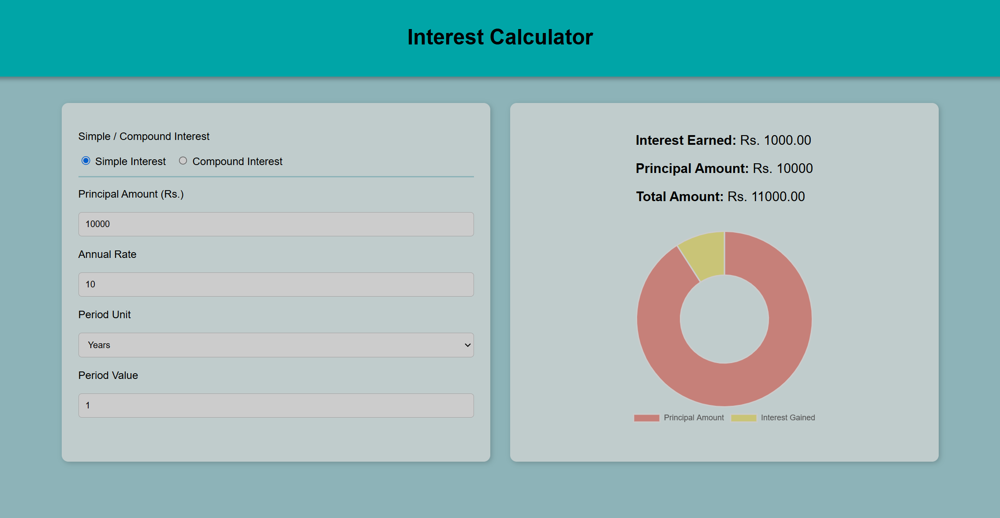

# 🔢Interest Calculator

This page is designed to help users calculate simple and compound interest on their savings.

## 🚀How to Use

- Choose the type of interest
- Enter the principal amount.
- Enter the interest rate.
- Enter the time period.
- View the interest gained.

## Calculate your Interest now!
Click here: [Interest Calculator](https://megzz24.github.io/interest_calculator/)

## 📸Screenshot

## ⚙️Tech Stack

  

